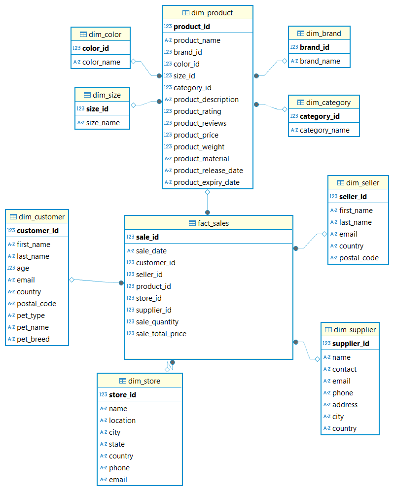

# Структура реализованной схемы "Снежинка"

 

### Как запустить проект

```bash
docker-compose up -d
```

*   **Хост:** `localhost`
*   **Порт:** `5432`
*   **База данных:** `bigdata`
*   **Пользователь:** `postgres`
*   **Пароль:** `postgres`


### Содержимое репозитория

*   `data/`: Исходные CSV-файлы (`MOCK_DATA_*.csv`).
*   `sql_scripts/`:
    *   `01_create_mock_table.sql`: Создание исходной таблицы `mock_data`.
    *   `02_import_csv.sql`: Импорт данных из CSV в `mock_data`.
    *   `03_snowflake_ddl.sql`: DDL для создания таблиц.
    *   `04_snowflake_dml.sql`: DML для заполнения таблиц.
    *   `analysis.sql`: Анализ исходных данных.
    *   `check.sql`: Скрипты для проверки корректности загрузки данных.
*   `docker-compose.yml`: Файл конфигурации Docker Compose для запуска PostgreSQL.

# BigDataSnowflake
Анализ больших данных - лабораторная работа №1 - нормализация данных в снежинку

Одна из задач data engineer при работе с данными BigData трансформировать исходную модель данных источника в аналитическую модель данных. Аналитическая модель данных позволяет исследовать данные и принимать на основе полученных данных решения. Классическими универсальными схемами для анализа данных являются "звезда" и "снежинка". В лабораторной работе вам предстоит потренироваться в трансформации исходных данных из источников в модель данных снежинка.

Что необходимо сделать?

Необходимо данные источника (файлы mock_data.csv с номерами), которые представляют информацию о покупателях, продавцах, поставщиках, магазинах, товарах для домашних питомцев трансформировать в модель снежинка (факты и измерения с нормализацией).


Алгоритм:
1. Клонируете к себе этот репозиторий.
2. Устанавливаете себе инструмент для работы с запросами SQL (рекомендую DBeaver).
3. Запускаете базу данных PostgreSQL (рекомендую установку через docker).
4. Скачиваете файлы с исходными данными mock_data( * ).csv, где ( * ) номера файлов. Всего 10 файлов, каждый по 1000 строк.
5. Импортируете данные в БД PostgreSQL (например, через механизм импорта csv в DBeaver). Всего в таблице mock_data должно находиться 10000 строк из 10 файлов.
6. Анализируете исходные данные с помощью запросов.
7. Выявляете сущности фактов и измерений.
8. Реализуете скрипты DDL для создания таблиц фактов и измерений.
9. Реализуете скрипты DML для заполнения таблиц фактов и измерений из исходных данных.
10. Проверяете полученный результат.
11. Отправляете результат на проверку лаборантам.
12. Обсуждаете работу с лаборантами.

Что должно быть результатом работы?
1. Репозиторий, в котором есть исходные данные mock_data( * ).csv, где ( * ) номера файлов. Всего 10 файлов, каждый по 1000 строк.
2. Файл docker-compose.yml с установкой PostgreSQL и заполненными данными из файлов mock_data(*).csv.
3. Скрипты DDL (SQL) создания таблиц фактов и измерений в соответствии с моделью снежинка.
4. Скрипты DML (SQL) заполнения таблиц фактов и измерений из исходных данных.
